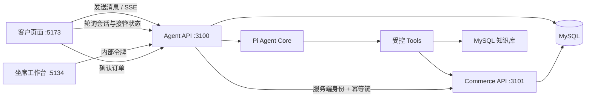

# Pi Customer Service Agent

一个可控的电商客服 Agent 示例，基于 Pi Agent Core 调用真实业务工具，用 MySQL 保存商品、库存、订单、退款申请、人工工单、会话记录和售后知识库。

它主要演示三件事：

- **模型只通过受控工具接触业务数据。** 模型不能读写数据库，只能调用 `src/core/tools/` 中定义的工具；价格和库存由服务端重新读取，客户端传入的参数不受信任。
- **有副作用的操作需要人确认。** 模型只能创建订单草稿，正式下单必须由客户在界面上点击确认；退款是否通过由人工审批，模型没有审批工具。
- **模型处理不了的时候安全交接给人。** 转人工会创建工单并绑定来源会话，坐席在独立工作台上认领、读取完整对话、回复和关闭；接管期间模型停止回答，关闭后交还，并且能看到人工此前说过什么。

前端有两个入口：客户页面 `5173` 和坐席工作台 `5134`；背后是 Agent API `3100` 与 Commerce API `3101`。



## 已实现能力

- 商品搜索、库存查询、订单列表与订单查询
- 售后知识库检索及来源返回
- 服务端价格校验的订单草稿，客户确认后下单，库存事务扣减和幂等保护
- 由服务端判定 7 天窗口的退款申请：模型只能创建草稿，客户在界面确认后才真正提交
- 客户可撤销尚未开始打款的退款申请，撤销后订单释放、可以重新申请
- 退款状态流转（待处理、已移交人工、审核通过、退款成功、驳回、执行失败、已撤销）
- 转人工工单，同一会话重复转人工复用同一张工单；坐席认领、读取客户完整会话、回复和关闭
- 人工接管期间模型停止回答，工单关闭后恢复，并且能看到人工此前说过什么
- 客户页面自动显示人工接入与人工回复，不需要刷新
- 坐席工作台：按状态过滤的工单队列、客户会话、认领、回复、关闭
- 坐席操作审计：认领、回复、关闭都留痕，被拒绝的尝试也记录原因码
- JWT 身份绑定、会话隔离、工具审计日志
- SSE 流式对话界面和可执行评测场景

## 本地启动

需要 Node.js 22、npm，以及已启动的 Docker Desktop。模型凭据复用 pi coding agent 的 `~/.pi/agent/models.json`：按 `LLM_PROVIDER` 查找同名 provider，读取其中的 `baseUrl` 和 `apiKey`，所以不需要再配一份密钥。该文件不存在时才回落到 `LLM_API_KEY` 环境变量。位置可用 `PI_CODING_AGENT_DIR` 覆盖。不要把真实密钥提交到仓库。

一键启动（MySQL、迁移、知识库和四个服务）：

```powershell
cd packages/customer-service-agent
.\run.ps1              # 完整启动并打开客户页面
.\run.ps1 -SkipSeed    # 跳过迁移与入库，只重启服务
.\run.ps1 -NoBrowser   # 启动但不自动打开浏览器
.\run.ps1 -Stop        # 停止四个服务（MySQL 容器保留）
```

启动完成后四个端口分别是：

| 服务 | 地址 | 用途 |
| --- | --- | --- |
| 客户页面 | `http://127.0.0.1:5173` | 客户与智能客服对话 |
| 坐席工作台 | `http://127.0.0.1:5134` | 人工处理工单 |
| Agent API | `http://127.0.0.1:3100` | 会话、工具调用、坐席接口 |
| Commerce API | `http://127.0.0.1:3101` | 商品、库存、订单、退款 |

MySQL 在 `3307`（容器内仍为 `3306`）。两个 Vite 前端都会把 `/api` 代理到 Agent API。

手动启动：

```powershell
cd packages/customer-service-agent
docker compose up -d
npm run db:migrate
npm run knowledge:ingest
```

然后分别打开四个 PowerShell 终端：

```powershell
npm run dev:commerce  # 3101
npm run dev:agent     # 3100
npm run dev:web       # 5173 客户页面
npm run dev:desk      # 5134 坐席工作台
```

若本机已有不同标签的 MySQL 镜像，可在启动前设置 `MYSQL_IMAGE`，无需修改 compose 文件。

## 使用指南

### 客户侧（5173）

1. 页面自动以演示用户登录，并恢复最近一次会话；左栏可以切换历史会话或新建会话。
2. 直接提问，例如“北京还有黑色降噪耳机吗”“帮我看看我最近下的订单”。
3. 让客服创建订单草稿后，聊天记录里会出现确认卡片。**只有点击卡片上的按钮才会正式下单并扣减库存**；刷新页面卡片会从会话记录中恢复。
4. 想退款的订单，客服会先创建一份**退款申请草稿**，聊天记录里出现“退款申请等待确认”卡片。**只有点击卡片上的按钮才会正式提交**，客服自己提交不了；不点就不会有任何申请产生。
5. 提交后改主意，说“算了不退了”，客服会撤销申请（状态变为“已撤销”），之后还能重新申请；已经审核通过的申请无法撤销。
6. 说“我要转人工”或提出投诉，客服会创建人工工单并给出工单号。此时会话仍归模型，因为还没有坐席认领，你继续提问它照常回答。
7. 坐席认领后，页面顶部出现“人工客服已接入”，之后你发的消息不会被模型回答，只留给坐席。
8. 坐席的回复会自动出现，署名“人工客服 + 工号”。工单关闭后模型恢复回答。

### 坐席侧（5134）

首次进入需要填两样东西，都保存在浏览器 localStorage：

- **内网 token**：默认 `change-me-for-production`，即 Agent 的 `DESK_TOKEN`（未单独设置时取 `COMMERCE_INTERNAL_TOKEN`）。填错会在下次请求时退回登录页。
- **工号**：认领时写入工单，也是客户看到的消息署名。

进入后：

1. 左栏是工单队列，按“待认领 / 处理中 / 已关闭”分档，队列和会话每 5 秒自动刷新。
2. 点开一张工单，右侧显示客户摘要和完整对话——包括订单号、退款单号这些客户之前说过、但没有写进工单摘要的上下文。
3. 点“认领这张工单”，客户会话进入人工接管，模型停止回答。
4. 在回复框输入内容并发送，客户页面几秒内自动出现这条回复。
5. 处理完点“关闭工单”（可填备注），会话交还模型，客户页面的接管提示消失。

两位坐席同时认领同一张工单是安全的：只有一个成功，另一位收到 409 并看到提示。

### 完整演练：一次人工交接

1. 客户页面说要转人工 → 坐席台“待认领”里自己出现这张工单（不需要刷新）
2. 坐席填写工号并认领 → 客户页面 3 秒内出现“人工客服已接入”
3. 客户再发一条消息 → 模型不回答，消息直接留给坐席
4. 坐席回复“您的问题已经解决，欢迎下次购物” → 客户页面自动显示，署名“人工客服 12314”
5. 坐席关闭工单 → 客户页面提示消失，模型恢复回答，并且知道人工已经处理过，不会重复提问

## 坐席接口

坐席工作台调用的接口，不用界面时也可以用 curl 直接操作。它们挂在 Agent API（`3100`）上，因为回复要写进客户会话。全部需要内部令牌，默认与 `COMMERCE_INTERNAL_TOKEN` 相同，可用 `DESK_TOKEN` 单独覆盖。

```powershell
$token = "change-me-for-production"
$base = "http://127.0.0.1:3100"

# 查看待认领的工单（可按 conversationId 过滤）
curl.exe -s "$base/api/support-tickets?status=open" -H "x-internal-token: $token"

# 读取这张工单来源会话的完整对话
curl.exe -s "$base/api/support-tickets/<ticketId>/messages" -H "x-internal-token: $token"

# 认领
curl.exe -s -X POST "$base/api/support-tickets/<ticketId>/claim" `
  -H "x-internal-token: $token" -H "content-type: application/json" `
  -d '{\"assignee\":\"客服小李\"}'

# 回复客户（写入原会话）
curl.exe -s -X POST "$base/api/support-tickets/<ticketId>/reply" `
  -H "x-internal-token: $token" -H "content-type: application/json" `
  -d '{\"text\":\"您好，我是人工客服小李。\"}'

# 关闭，会话交还智能客服
curl.exe -s -X POST "$base/api/support-tickets/<ticketId>/close" `
  -H "x-internal-token: $token" -H "content-type: application/json" `
  -d '{\"note\":\"已电话沟通\"}'
```

认领之后该会话进入人工接管：模型不再回答，客户的新消息直接留给坐席；回复会以「人工客服 + 姓名」出现在客户的聊天记录里。关闭工单后模型恢复回答，并且能看到人工此前说过什么。

## 测试与评测

单元测试和 API 集成测试不连接真实数据库或模型：

```powershell
npm run test
```

服务全部启动后运行模型工具选择评测：

```powershell
npm run eval
```

评测会逐场景创建独立会话，并检查模型是否调用预期工具。当前知识库使用 MySQL `LIKE` 检索，适合少量固定客服政策。恢复 Milvus 时只需实现相同的 `KnowledgeGateway` 接口并重新执行 `knowledge:ingest`，不会影响 Agent 工具或业务接口。

可单独验证知识库检索：

```powershell
npm run knowledge:verify -- 配送
```

## 数据库迁移

`migrations/*.sql` 按文件名顺序执行，已执行的文件名记录在 `schema_migrations`，因此 `npm run db:migrate` 可以重复运行。

`001_initial.sql` 是幂等基线；表结构变更要新增编号文件并用 `ALTER TABLE`，因为 MySQL 8 不支持 `ADD COLUMN IF NOT EXISTS`，幂等性由版本表保证。

## 安全边界

- `userId` 由服务端 JWT 注入，模型不能指定其他用户。
- 模型没有直接提交订单的工具，只能创建草稿。
- 退款资格（7 天窗口）由 Commerce API 按下单时间判定，模型不能自行判断或承诺能否退款。
- 退款申请写入后只为待处理状态，模型没有审批退款的工具；状态流转由需要内网令牌的内部接口推动，Agent 网关里没有对应方法。
- 退款申请只能查询本人的，且不下发审核人身份与内部备注。
- 坐席接口只认内部令牌、不绑定客户身份；模型没有认领、回复或关闭工单的工具，只能开单。
- 坐席读取会话必须经由工单：会话 id 由工单反解，坐席读不到自己没有工单的对话。
- 客户侧的接管状态由服务端按“是否存在指向该会话的 assigned 工单”现算，客户端不能自行声明已转人工。
- 人工接管期间模型不参与该会话，避免人机同时回答；人工回复的署名取自工单认领人。
- 会话写入是增量追加，模型回答结束时不会覆盖坐席在此期间写入的回复。
- 价格和库存由 Commerce API 重新读取，客户端参数不受信任。
- 下单在 MySQL 事务中锁定库存，并用唯一幂等键防止重复订单。
- 默认密钥只适合本地开发，部署前必须替换并限制两个 API 的网络访问范围。

## 已知限制

这份示例刻意停留在可演示的程度。以下都是有意的简化，不是待修的 bug：

- **认证是演示级。** `/api/auth/demo` 只允许配置的演示用户登录；坐席用共享内部令牌，没有独立坐席身份，因此审计里的工号只能取自工单的认领人——被拒绝且无人认领的尝试，工号一栏是空的。
- **退款草稿不会过期。** 未被确认的草稿会一直留着，即使订单已经超出退款窗口；此时确认会被拒绝并说明原因，但草稿本身不会自动清理。
- **复用未关闭工单时沿用首次摘要。** 同一会话再转人工只会拿到原来那张工单，摘要保持第一次的内容；更新的上下文在会话里，坐席读会话就能看到。
- **并发防护的集成测试不进默认套件。** `test/integration/concurrency.test.ts` 用八个并发请求验证订单提交、退款申请、工单认领与关闭，需要可达的 MySQL；数据库连不上时自动跳过，也可以用 `npm run test:integration` 显式运行。重启后重放、跨客户重放和依赖超时仍未覆盖。
- **会话级并发锁是进程内的。** `activeConversations` 是 Agent 进程里的 `Set`，多实例部署会失效。
- **外部调用没有韧性措施。** `CommerceHttpGateway` 的 `fetch` 没有超时、重试和熔断。
- **物流查询和取消申请不存在。** 没有对应的表、适配器、工具和状态契约。
- **客户看不到工单状态。** 没有面向客户的工单查询工具，客户只能从会话提示判断人工是否已接入。
- **知识库是关键词检索。** 用 MySQL `LIKE` 实现，不返回版本和生效时间，适合少量固定政策文档。
- **`002` 迁移之前的工单没有会话关联。** 那些工单的 `conversation_id` 为空，坐席台会标记“无关联会话”且无法回复，这部分数据无法回填。

功能缺口和任务拆分见 [ROADMAP.md](ROADMAP.md)，已实现能力的细节见 [IMPLEMENTED_FEATURES.md](IMPLEMENTED_FEATURES.md)。
