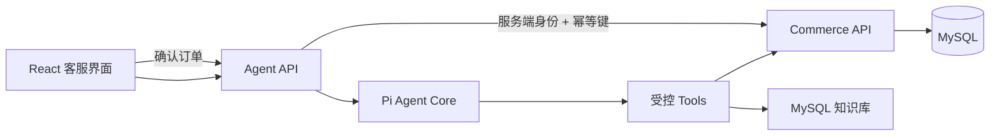

# Pi Customer Service Agent

一个可控的电商客服 Agent 示例。它基于 Pi Agent Core 调用真实业务工具，MySQL 保存商品、库存、订单、退款申请、审计数据和暂时的售后知识库。模型只能创建订单草稿和提交退款申请；最终下单必须由用户在界面中确认，退款是否通过由人工审批。



## 已实现能力

- 商品搜索、库存查询、订单列表与订单查询
- 售后知识库检索及来源返回
- 服务端价格校验的订单草稿
- 用户确认后下单、库存事务扣减和幂等保护
- 由服务端判定 7 天窗口的退款申请，写入后等待人工审批
- 退款进度查询与状态流转（待处理、已移交人工、审核通过、退款成功、驳回、执行失败）
- 转人工工单
- JWT 身份绑定、会话隔离、工具审计日志
- SSE 流式对话界面和可执行评测场景

## 本地启动

需要 Node.js 22、npm，以及已启动的 Docker Desktop。模型凭据复用 pi coding agent 的 `~/.pi/agent/models.json`：按 `LLM_PROVIDER` 查找同名 provider，读取其中的 `baseUrl` 和 `apiKey`，所以不需要再配一份密钥。该文件不存在时才回落到 `LLM_API_KEY` 环境变量。位置可用 `PI_CODING_AGENT_DIR` 覆盖。不要把真实密钥提交到仓库。

```powershell
cd packages/customer-service-agent
docker compose up -d
npm run db:migrate
npm run knowledge:ingest
```

然后分别打开三个 PowerShell 终端：

```powershell
npm run dev:commerce
npm run dev:agent
npm run dev:web
```

访问 `http://127.0.0.1:5173`。Vite 会把 `/api` 代理到 Agent API。默认端口是 Agent `3100`、Commerce `3101`、MySQL `3307`（容器内仍为 `3306`）。

若本机已有不同标签的 MySQL 镜像，可在启动前设置 `MYSQL_IMAGE`，无需修改 compose 文件。

## 测试与评测

单元测试和 API 集成测试不连接真实数据库或模型：

```powershell
npm run test
```

服务全部启动后运行模型工具选择评测：

```powershell
npm run eval
```

评测会逐场景创建独立会话，并检查模型是否调用预期工具。当前知识库使用 MySQL `LIKE` 检索，适合少量固定客服政策。恢复 Milvus 时只需实现相同的 `KnowledgeGateway` 接口并重新执行 `knowledge:ingest`，不会影响 Agent 工具或业务接口。

可单独验证知识库检索：

```powershell
npm run knowledge:verify -- 配送
```

## 安全边界

- `userId` 由服务端 JWT 注入，模型不能指定其他用户。
- 模型没有直接提交订单的工具，只能创建草稿。
- 退款资格（7 天窗口）由 Commerce API 按下单时间判定，模型不能自行判断或承诺能否退款。
- 退款申请写入后只为待处理状态，模型没有审批退款的工具；状态流转由需要内网令牌的内部接口推动，Agent 网关里没有对应方法。
- 退款申请只能查询本人的，且不下发审核人身份与内部备注。
- 价格和库存由 Commerce API 重新读取，客户端参数不受信任。
- 下单在 MySQL 事务中锁定库存，并用唯一幂等键防止重复订单。
- 默认密钥只适合本地开发，部署前必须替换并限制两个 API 的网络访问范围。
